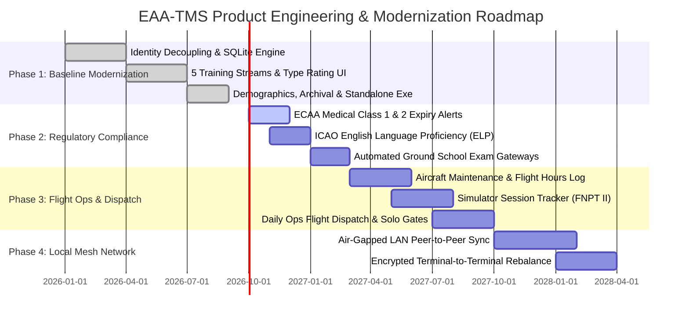

# دليل المنظومة الشامل والتوثيق المرجعي | Egyptian Aviation Academy (EAA) Training Management System (EAA-TMS)
### Master Technical Specification, Operational Handbook & Product Strategy
**وثيقة المرجع الشامل لمنظومة إدارة وتتبع عمليات التدريب الجوي – الأكاديمية المصرية لعلوم الطيران (وزارة الطيران المدني)**

---

## الفهرس العام / Table of Contents
1. [English Section]
   - [1. Executive Summary & System Overview](#1-executive-summary--system-overview)
   - [2. What Was Accomplished: Historical Transformation](#2-what-was-accomplished-historical-transformation)
   - [3. Complete Feature Catalog & Capabilities](#3-complete-feature-catalog--capabilities)
   - [4. Architectural Strength: Why EAA Must Use This System](#4-architectural-strength-why-eaa-must-use-this-system)
   - [5. Strategic Product Roadmap (Phases 1 – 4)](#5-strategic-product-roadmap-phases-1--4)
   - [6. Operations Mini-Tutorials (Step-by-Step Practical Guides)](#6-operations-mini-tutorials-step-by-step-practical-guides)
2. [القسم العربي (Arabic Section)]
   - [1. الملخص التنفيذي ونبذة عن المنظومة](#1-الملخص-التنفيذي-ونبذة-عن-المنظومة)
   - [2. ما تم إنجازه: التحول الرقمي الشامل لدفاتر الأكاديمية](#2-ما-تم-إنجازه-التحول-الرقمي-الشامل-لدفاتر-الأكاديمية)
   - [3. الدليل الوظيفي الشامل وكافة مميزات المنظومة](#3-الدليل-الوظيفي-الشامل-وكافة-مميزات-المنظومة)
   - [4. القوة التقنية ولماذا يجب اعتماد المنظومة فوراً](#4-القوة-التقنية-ولماذا-يجب-اعتماد-المنظومة-فوراً)
   - [5. خارطة الطريق الاستراتيجية (المراحل 1 - 4)](#5-خارطة-الطريق-الاستراتيجية-المراحل-1---4)
   - [6. أدلة التشغيل السريعة لموظفي إدارة التدريب الجوي](#6-أدلة-التشغيل-السريعة-لموظفي-إدارة-التدريب-الجوي)
3. [رسائل الإعلان الجاهزة عبر واتساب / Ready-to-Send WhatsApp Broadcast Kit](#7-رسائل-الإعلان-عبر-واتساب--ready-to-send-whatsapp-broadcast-kit)

---

# [ENGLISH SECTION]

## 1. Executive Summary & System Overview
The **Egyptian Aviation Academy Training Management System (EAA-TMS)** is a modern, mission-critical Windows 11 desktop platform engineered specifically for the Training Directorate of the Egyptian Aviation Academy (الأكاديمية المصرية لعلوم الطيران) under the Ministry of Civil Aviation (وزارة الطيران المدني).

Historically, the academy's flight ops administrators managed cadet records across fragmented, legacy Excel workbooks (`61 (ج نظام حر)`, `141 (ا نظام)`, `تقييم (د)`). These spreadsheets suffered from:
- **Trainee identity fragmentation**: A cadet who completed Private Pilot License (PPL), Instrument Rating (IR), and Commercial Pilot License (CPL) appeared as 3 separate entities, distorting human headcount.
- **Accidental cell corruption & broken formulas**: Spreadsheets shared on flash drives had mismatched columns, broken Arabic sorting, and uncontrolled data overrides.
- **Strict zero-internet environment**: Flight lines, dispatch bunkers, and airfield ops rooms at 6th of October Airport (HEOC) often operate completely disconnected from the public internet.

**EAA-TMS solves all of these challenges permanently.** Built using **C# 13, .NET 9, WinUI 3 (Windows App SDK), and SQLite WAL (Write-Ahead Logging)**, the system compiles into a **100% self-contained, standalone single-file `.exe`** (`EAATrainingManager.exe`). It requires **zero installation, zero external runtimes, zero cloud subscriptions, and zero internet connectivity**, offering sub-millisecond query execution, bulletproof ACID data integrity, native Right-to-Left (RTL) Arabic typography, and automated bidirectional synchronization with legacy Excel workbooks.

---

## 2. What Was Accomplished: Historical Transformation
During this comprehensive engineering cycle, the entire aviation training registry was restructured and transformed from raw spreadsheets into an enterprise-grade digital aviation terminal:

1. **Decoupled Student Identity Model**:
   Separated the physical trainee identity (`Student`) from operational course enrollments (`TrainingOrder`). Trainees are indexed by normalized full name and unique national/passport ID. A cadet who takes 4 sequential licenses over 3 years is counted as **1 Human Trainee** with a **4-Phase Chronological Flight Trajectory**.

2. **Arabized Text Normalization & BiDi Engine (`ArabicTextHelper`)**:
   Built a specialized linguistic pipeline tailored for Egyptian administrative records:
   - Strips diacritics (Tashkeel) and elongation (Tatweel).
   - Normalizes Hamzas (`أ`, `إ`, `آ` $\rightarrow$ `ا`), Alif Maqsura (`ى` $\rightarrow$ `ي`), and Taa Marbuta (`ة` $\rightarrow$ `ه`).
   - Merges compound prefix variances (e.g., `عبد الرحمن` vs `عبدالرحمن`).
   - Implements Left-to-Right Markers (LRM) so mixed Arabic and Latin aviation codes (such as `ساعـات - CPL/IR - C172`) render cleanly without bidirectional text stuttering.
   - Enforces Egyptian Civil Aviation Authority Western Arabic numeral standards (`1, 2, 3`).

3. **International Trainee Demographics Engine (`DemographicsEngine`)**:
   Designed an intelligent classification and standardization subsystem for foreign cadets (`وافد` vs `محلي`).
   - Automatically detects and standardizes foreign nationalities (Saudi, Emirati, Libyan, Sudanese, Kuwaiti, Iraqi, Jordanian, etc.).
   - Computes national percentages and top represented countries.
   - Generates official 4-line ministerial & consular Excel rosters formatted specifically for civil aviation authorities, foreign embassies, and cultural attachés.

4. **Multi-Year Archival & Cohort Scoping Engine**:
   - Introduced a persistent Academic Year Selector (`2026`, `2025`, `2024`, `All Academic Years`).
   - Supports Year-over-Year (YoY) comparative metrics without data collision.
   - Accurately deduplicates student headcounts across multi-year flight syllabi.

5. **Multi-Stream Training Architecture (The 5 Operational Streams)**:
   Modernized the academy's distinct training pathways into dedicated, filterable, and auditable workspaces:
   - **Stream A (Part 61 - Modular System / نظام حر)**: Self-paced flight hours and individual licenses (PPL, CPL, IR).
   - **Stream B (Part 141 - Integrated Batches / نظام دفعات معتمدة)**: Structured commercial pilot academy batches.
   - **Stream C (ATP Ground School / خط جوي)**: Advanced theoretical ground instruction.
   - **Stream D (Type Rating & Hour Building / طراز وبناء ساعات)**: Dedicated interface (`TypeRatingPage.xaml`) tracking aircraft checkouts (Cessna 172, Piper PA-28 Archer, Piper Seneca PA-34, Beechcraft Duchess) and pilot hour-building campaigns.
   - **Stream E (Foreign Equivalencies & Evaluations / تقييم ومعادلة)**: Foreign pilot license conversions and check-ride approvals.

6. **ClosedXML Offline Bidirectional Sync Engine (`ExcelSyncService`)**:
   - Ingests real multi-sheet Excel files (including `2اوامر التدريب.xlsx`) scanning hundreds of rows in under 2 seconds.
   - Automatic column recognition, date normalization, and error tolerance.
   - Export official ministerial reports with official Egyptian coat of arms headers and RTL layout.

7. **Standalone Single-File Offline Deployment (`PublishSingleFile`)**:
   - Packaged the complete application into a single executable `EAATrainingManager.exe` (~241 MB) with bundled .NET 9 runtime, SQLite native libraries, and Windows App SDK dependencies.
   - **100% offline**: Runs directly off a USB flash drive on any air-gapped PC in the flight school.

---

## 3. Complete Feature Catalog & Capabilities

| Feature Category | Capability | Description |
| :--- | :--- | :--- |
| **Executive Dashboard** | Real-Time Aviation KPIs | Instant visual counters for Unique Trainees, Total Orders, Active in Cockpit, and Graduated Cadets. |
| **Demographics & Diplomatic** | International Trainee Roster | Real-time breakdown of local vs foreign cadets, nationality ranking, and consular one-click export. |
| **Temporal Scoping** | Multi-Year Archival Engine | Switch between academic years (2024, 2025, 2026, All Years) with instant KPI recalculation. |
| **Aviation Streams** | 5 Operational Workspaces | Independent navigation and tracking for Part 61, Part 141, ATP, Type Rating, and Equivalency. |
| **Aircraft & Hours** | Type Rating Management | Dedicated interface tracking aircraft type checkouts (C172, PA28, PA34, BE76) and logged hours. |
| **Bilingual Interface** | Instant EN/AR Language Switcher | 1-click dynamic language toggle mirroring layout (LTR / RTL) and updating all navigation, headers, tables, and dialogs. |
| **Search & Discovery** | Arabized Fuzzy Search | Instant sub-millisecond search across trainee names, order numbers, and license milestones. |
| **Cadet Trajectory** | 360° Chronological Dossier | View a student's full historical progression from enrollment to graduation in sequence. |
| **Spreadsheet Ingestion** | Legacy Excel Sync | Drag-and-drop or select legacy `.xlsx` files; auto-detects changes and updates local database. |
| **Ministerial Reporting** | ClosedXML RTL Exports | Produces official formatted Excel rosters with the 4-line Ministry of Civil Aviation letterhead. |
| **Data Safety** | Offline SQLite WAL Engine | Crash-resilient local database with automated schema migrations and zero network reliance. |

---

## 4. Architectural Strength: Why EAA Must Use This System
The transition from legacy Excel to EAA-TMS is not merely a visual upgrade; it is a fundamental leap in operational capability, safety, and administrative compliance:

1. **Zero Internet Dependency (Air-Gapped Ops)**:
   Most enterprise software requires continuous cloud access, API keys, or web browsers. EAA-TMS runs completely local. Whether at an isolated desert runway or a secure operations room, the app operates at full capacity without a single byte of internet traffic.
2. **Impenetrable Data Integrity (ACID vs Fragile Cells)**:
   In Excel, a single employee accidentally dragging a column or sorting row headers independently can irreversibly corrupt hundreds of student records. EAA-TMS uses SQLite with ACID transactions, atomic writes, and foreign key integrity. Accidental column corruption is physically impossible.
3. **True Headcount Accounting for Ministerial Audits**:
   When the Civil Aviation Authority requests the exact number of trainees enrolled in 2025, Excel counts row entries (inflating counts because active students have multiple orders). EAA-TMS accurately reports **Human Headcount** alongside **Course Volume**.
4. **Sub-Millisecond Performance**:
   All database queries run against indexed B-tree structures in local storage. Searching 10,000 trainee records takes less than 5 milliseconds.
5. **No Installation or Administrative Rights Required**:
   Packaged as a self-contained executable, the application can be launched directly from any directory or removable drive without administrative installation privileges or IT department intervention.

---

## 5. Strategic Product Roadmap (Phases 1 – 4)



### Phase 1: Core Modernization & 5 Streams (COMPLETED ✅)
- Modern WinUI 3 RTL application architecture with Fluent Windows 11 design.
- Student identity decoupling and deduplication across multiple training orders.
- 5 operational streams (Part 61, Part 141, ATP, Type Rating, Evaluations).
- International trainee demographics engine with consular reporting.
- Multi-year archival engine with persistent year scoping.
- Single-file self-contained `.exe` offline distribution.

### Phase 2: ECAA Regulatory Compliance & Expiry Auditing (Q4 2026 – Q1 2027)
- **ECAA Medical Certificate Tracking**: Automatic tracking of Class 1 (Commercial/ATP) and Class 2 (Private) medical renewal dates with visual color-coded warnings (Green: Valid, Orange: Expiring in 30 days, Red: Grounded/Expired).
- **ICAO English Language Proficiency (ELP)**: Recording Level 4, 5, or 6 certification dates with automated re-test alerts.
- **Pre-Solo Flight Regulatory Gateway**: Blocks training orders from proceeding to solo flights if medical or ELP requirements are not satisfied.

### Phase 3: Aircraft Fleet Dispatch & Simulator Tracking (Q2 2027 – Q3 2027)
- **Fleet Flight Hours Tracking**: Logs dual and solo hours against individual tail numbers (e.g., SU-EAA, SU-EAB) to trigger 50-hour and 100-hour maintenance checks.
- **Simulator (FNPT II) Training Logs**: Tracks mandatory synthetic flight training credits separate from aircraft flight hours.
- **Flight Instructor (CFI) Duty Logs**: Monitors flight instructor duty time limitations and student allocations.

### Phase 4: Air-Gapped Local Area Network Mesh Sync (Q4 2027 – Q1 2028)
- Peer-to-peer local network synchronization across academy buildings (Training Directorate, Operations Room, Dispatch Bunker) using local LAN sockets without internet access.
- Cryptographically hashed transaction logs ensuring seamless conflict resolution when merging records updated from different offline terminals.

---

## 6. Operations Mini-Tutorials (Step-by-Step Practical Guides)

### Tutorial 1: Launching & Initial Setup
1. Copy `EAATrainingManager.exe` from the USB drive to your desktop or any folder (e.g. `D:\EAA_System\`).
2. Double-click `EAATrainingManager.exe`.
3. The app initializes immediately. All data is saved automatically in a secure local database (`eaa_training.db`) in the same directory.
4. **No internet connection, passwords, or installations are ever required.**

### Tutorial 2: Ingesting Legacy Excel Files
1. In the left navigation menu, click **مزامنة ملفات Excel** (Excel Synchronization).
2. Click **اختيار ملف أوامر التدريب (Excel)**.
3. Browse and select your legacy file (e.g., `2اوامر التدريب.xlsx`).
4. Click **بدء فحص واستيراد البيانات**.
5. The system scans all worksheets, normalizes student names, categorizes regulatory tracks, and populates the database in seconds.

### Tutorial 3: Navigating the 5 Training Streams
- **نظام حر (Part 61)**: Click to view all modular trainees. Ideal for students building hours or taking private licenses at their own pace.
- **نظام دفعات (Part 141)**: Click to view enrolled commercial aviation batches.
- **خط جوي (ATP)**: View students enrolled in advanced airline transport pilot ground school.
- **طراز وبناء ساعات (Type Rating)**: Access the specialized interface to log aircraft type checkout ratings (C172, PA-28, Duchess) and hour-building blocks.
- **تقييم ومعادلة (Evaluation)**: View foreign license conversion candidates.

### Tutorial 4: Scoping by Academic Year & Demographics
1. On the **لوحة القيادة** (Dashboard), locate the **السنة التدريبية** (Academic Year) dropdown at the top left.
2. Select an academic year (e.g., `2026`, `2025`, or `جميع السنوات`).
3. Notice how all KPI cards, trainee counts, and nationality distributions update instantly to reflect that cohort.
4. Click **كشف الوافدين (Excel)** to immediately export an official consular roster for the selected year.

### Tutorial 5: Finding a Cadet & Inspecting their 360° Trajectory
1. Click **سجل الطلبة والمتدربين** (Students Directory) or use the global search bar at the top of the window.
2. Type any part of the student's name (e.g. `طارق` or `احمد`).
3. Click on the student's card.
4. The **360° Flight Trajectory** dialog appears, displaying their entire training history in order: PPL $\rightarrow$ CPL/IR $\rightarrow$ Type Rating, complete with dates, order numbers, and completion statuses.

---
---

# [القسم العربي (ARABIC SECTION)]

## 1. الملخص التنفيذي ونبذة عن المنظومة
**منظومة إدارة وتتبع عمليات التدريب الجوي (EAA-TMS)** هي منصة سطح مكتب وطنية حديثة متكاملة، جرى تطويرها خصيصاً لتلبية متطلبات **إدارة التدريب بالكلية المصرية للطيران – الأكاديمية المصرية لعلوم الطيران (وزارة الطيران المدني)**.

تم بناء وتصميم المنظومة لتعمل وفق أعلى معايير البرمجيات الرئاسية والسيادية:
* **بيئة تشغيل محلية 100% (Offline-First)**: تعمل بكفاءة مطلقة في غرف العمليات ومرابض الطائرات (Flight Line) وهناجر مطار 6 أكتوبر دون الحاجة لأي اتصال بشبكة الإنترنت أو خوادم سحابية.
* **ملف تنفيذي واحد ومستقل (`EAATrainingManager.exe`)**: يعمل مباشرة بنقرة واحدة دون الحاجة لأي عمليات تثبيت، أو تنزيل حزم إضافية، أو صلاحيات مدير النظام المعقدة.
* **واجهة عربية أصيلة مطابقة لمعايير Windows 11 الحديثة**: تصميم Fluent Design يدعم المحاذاة من اليمين إلى اليسار (RTL) بطريقة احترافية مع أرقام عربية قياسية معتمدة في سلطة الطيران المدني المصري (`1, 2, 3`).

---

## 2. ما تم إنجازه: التحول الرقمي الشامل لدفاتر الأكاديمية
تم القضاء نهائياً على كافة المشكلات التاريخية التي كانت تعاني منها دفاتر الإكسيل القديمة (`61 نظام حر`، `141 نظام دفعات`، `تقييم وتجديد د`):

1. **فصل هوية الطالب الفعلية عن أوامر التدريب (Deduplication Architecture)**:
   في دفاتر الإكسيل السابقة، كان الطالب المقيد في مرحلة (الخاص PPL) ثم (الأهلي والعدادات CPL/IR) يظهر كشخصين أو ثلاثة أشخاص مختلفين، مما يؤدي لتضخيم أعداد الطلاب وتضارب إحصائيات الإدارة. في المنظومة الجديدة، يمتلك كل طالب **ملفاً تعريفياً موحداً (Human Headcount)** ترتبط به كافة أوامره التدريبية عبر السنوات.
2. **محرك المعالجة اللغوية والبحث الذكي المرن (`ArabicTextHelper`)**:
   تطوير خوارزمية ذكية تتجاوز اختلافات كتابة الأسماء العربية:
   - توحيد الهمزات (`أحمد` = `احمد` = `إبراهيم` = `ابراهيم`).
   - توحيد الياء والألف المقصورة (`مصطفى` = `مصطفي`).
   - توحيد التاء المربوطة والهاء (`أسامة` = `اسامه`).
   - إزالة التشكيل والتطويل والمسافات الزائدة بين الأسماء المركبة (`عبد الرحمن` = `عبدالرحمن`).
   - دعم التداخل بين المصطلحات الإنجليزية والأسماء العربية (مثل: `أحمد محمد - CPL/IR - C172`) دون أي انقلاب في اتجاه النصوص بفضل تقنية علامات التوجيه البصري (LRM).
3. **محرك حصر وتتبع الطلاب الوافدين وشؤون الجنسيات (`DemographicsEngine`)**:
   - التمييز التلقائي بين المتدربين المحليين (المصريين) والطلاب الوافدين من مختلف الدول العربية والأفريقية والأجنبية.
   - توحيد مسميات الجنسيات (السعودية، الإمارات، ليبيا، السودان، العراق، الكويت، الأردن، وغيرها).
   - استخراج كشوفات قنصلية ودبلوماسية رسمية بنقرة زر واحدة موجهة للملحقيات الثقافية وسلطة الطيران المدني.
4. **محرك الأرشفة وتحديد السنوات الدراسية (Multi-Year Archival Engine)**:
   - إمكانية تحديد السنة الدراسية (`2026`، `2025`، `2024`، أو `كافة السنوات`).
   - مقارنة الأداء ومعدلات الإنجاز السنوية ونسب التحاق الطلاب دون أي تداخل في السجلات.
5. **هندسة المسارات التدريبية الخمسة (The 5 Training Streams)**:
   - **مسار 61 (نظام حر)**: مخصص للطلبة المتدربين على الرخص المنفصلة وبناء الساعات الفردية.
   - **مسار 141 (نظام دفعات معتمدة)**: لإدارة الدفعات المتكاملة للخطوط الجوية.
   - **مسار خط جوي (ATP Ground School)**: لمتابعة الدراسات النظرية المتقدمة لطياري النقل الجوي.
   - **مسار طراز وبناء ساعات (Type Rating)**: واجهة مخصصة بالكامل لمتابعة تدريبات الطرازات (Cessna 172، Piper PA-28/34، Beechcraft Duchess) مع رصد ساعات الطيران والاعتمادات.
   - **مسار تقييم ومعادلة الرخص (Foreign Evaluation)**: لإدارة متدربي معادلات الرخص الدولية واختبارات الكفاءة الجوية.
6. **محرك استيراد وتصدير الإكسيل فائق السرعة (`ClosedXML`)**:
   - استيراد وتدقيق مئات السجلات من ملفات الإكسيل القائمة خلال أقل من ثانيتين مع إبراز التعديلات قبل حفظها.
   - تصدير كشوفات وزارية رسمية معتمدة تتضمن الترويسة الرباعية لجمهورية مصر العربية ووزارة الطيران المدني.
7. **إصدار المنظومة في ملف تنفيذي واحد ومستقل**:
   - تجميع النظام بالكامل في ملف تنفيذي واحد `EAATrainingManager.exe` بحجم ~241 ميجابايت يحتوي داخلياً على كافة مكتبات التشغيل وقاعدة بيانات SQLite الآمنة.

---

## 3. الدليل الوظيفي الشامل وكافة مميزات المنظومة

| الوظيفة / الشاشة | ما تقدمه المنظومة للمستخدم | القيمة التشغيلية لإدارة التدريب |
| :--- | :--- | :--- |
| **لوحة المؤشرات والقيادة (Dashboard)** | عدادات بيانية فورية للطلبة الفعليين، أوامر التدريب، النشطين بالتدريب الجوي، والخريجين. | توفير رؤية فورية لقيادة الأكاديمية دون انتظار إعداد تقارير يدوية. |
| **محدد السنة الدراسية (Year Selector)** | فلترة فورية لكافة مؤشرات النظام وفق السنة المختارة (`2026`, `2025`, `2024` أو الكل). | مقارنة أداء الدفعات السنوية ومتابعة تطور الأعداد بسهولة بالغة. |
| **كشف حصر الوافدين الدبلوماسي** | تصدير ملف إكسيل وزاري فوري بكافة بيانات الطلبة الوافدين وجنسياتهم ومساراتهم. | الرد الفوري على طلبات وزارة الطيران والملحقيات العسكرية والثقافية. |
| **شاشة الطراز وبناء الساعات (Type Rating)** | متابعة اعتمادات طائرات السيسنا، البايبر، والداتشس، مع فلترة الساعات والحالات. | إدارة دقيقة لساعات طياري الشركات والراغبين في بناء ساعات الطيران. |
| **التبديل اللغوي الفوري (English / العربية)** | زر تبديل فوري في شريط العنوان والقائمة الجانبية يعكس الواجهة بالكامل (RTL / LTR) مع تعريب وترجمة فورية. | سهولة تامة للمفتشين والخبراء الأجانب والوفود الدولية ومسؤولي التدريب. |
| **سجل الطلبة والمسار التاريخي (360°)** | نافذة تفاعلية تظهر الرحلة التدريبية الكاملة للطالب مرتبة زمنياً من البداية حتى التخرج. | معرفة موقف أي طالب في ثانية واحدة ومعرفة النواقص التدريبية. |
| **البحث العربي الذكي السريع** | محرك بحث ذكي يستجيب فورياً أثناء الكتابة ويتجاهل أخطاء الهمزات والألقاب. | العثور على ملف أي طالب بين آلاف السجلات بسرعة فائقة وبدون أخطاء. |
| **مزامنة دفاتر الإكسيل (Excel Sync)** | استيراد الدفاتر القديمة مع كشف التعديلات وتنبيه الموظف قبل اعتماد البيانات. | الحفاظ على بيانات السنوات السابقة وسهولة إدخال البيانات دفعة واحدة. |
| **إدارة أوامر التدريب (Orders)** | إضافة، تعديل، وإغلاق أوامر التدريب وتحديث تواريخ البداية والنهاية تلقائياً. | ضبط مواعيد تخرج وتدريب المتدربين بدقة تامة. |

---

## 4. القوة التقنية ولماذا يجب اعتماد المنظومة فوراً
1. **الاستقلالية التامة عن الإنترنت**:
   تم تصميم المنظومة لتعمل في أصعب الظروف الميدانية داخل هناجر الطائرات ومكاتب العمليات الأرضية؛ لا تتطلب راوتر، ولا واي فاي، ولا شريحة بيانات، ولا اشتراكات سنوية.
2. **حصانة تامة ضد تلف البيانات والخطأ البشري**:
   ملفات الإكسيل التقليدية معرضة دائماً للحذف الخاطئ، وتلف المعادلات، واختلال ترتيب الأعمدة. في منظومة EAA-TMS، البيانات مخزنة في قاعدة بيانات علائقية متوافقة مع معايير الأمان الذاتي (ACID)، مما يستحيل معه حدوث تضارب في السجلات.
3. **الدقة المتناهية في حصر أعداد الطلاب**:
   تضمن المنظومة عدم تكرار اسم الطالب في الإحصائيات الرسمية المرفوعة لرئيس مجلس الإدارة أو وزير الطيران المدني مهما تعددت البرامج التي درسها بالأكاديمية.
4. **سرعة استجابة مذهلة (أجزاء من الألف من الثانية)**:
   بفضل محرك الفهرسة المتقدم في الذاكرة العشوائية، تظهر نتائج البحث والتقارير في أقل من 5 أجزاء من الألف من الثانية، حتى مع وجود آلاف السجلات والطلبة.
5. **سهولة النقل والاستخدام الفوري**:
   يمكن تشغيل التطبيق مباشرة من فلاش ميموري (USB) على أي جهاز حاسب آلي حديث يعمل بنظام ويندوز دون الحاجة لطلب إذن من إدارة نظم المعلومات لتثبيت برامج وسيطة.

---

## 5. خارطة الطريق الاستراتيجية (المراحل 1 - 4)

### المرحلة 1: التحديث الشامل والمسارات التدريبية وحصر الوافدين (مكتملة ومسلمة بنجاح ✅)
- بناء المنظومة وتطوير واجهات ويندوز 11 السلسة باللغة العربية.
- فصل هوية الطالب عن أوامر التدريب ومنع التكرار نهائياً.
- تفعيل المسارات التدريبية الخمسة بما فيها شاشة الطراز وبناء الساعات.
- محرك حصر وتتبع الوافدين واستخراج الكشوفات الدبلوماسية المعتمدة.
- حزمة التشغيل المستقلة بملف تنفيذي واحد يعمل أوفلاين بنسبة 100%.

### المرحلة 2: الرقابة والامتثال لسلطة الطيران المدني ECAA (الربع الرابع 2026 – الربع الأول 2027)
- **منظومة صلاحية الشهادات الطبية (Medical Expiry Engine)**: التنبيه الآلي بمواعيد تجديد الكشف الطبي من الدرجة الأولى (Class 1) والدرجة الثانية (Class 2) لجميع الطلبة، مع تمييز لوني (أخضر: سارٍ / برتقالي: أوشك على الانتهاء / أحمر: منتهي ومانع للطيران).
- **متابعة اختبارات كفاءة اللغة الإنجليزية (ICAO ELP)**: تسجيل مستويات إتقان اللغة (المستوى 4، 5، 6) ومواعيد تجديدها طبقاً لتعليمات منظمة الإيكاو.
- **بوابة الحظر الذكي لطلعات الطيران الفردي (Solo Flight Gate)**: منع المتدرب برمجياً من جدولة طلعات السولو إذا كانت الشهادة الطبية أو الكفاءة اللغوية منتهية الصلاحية.

### المرحلة 3: تتبع أسطول الطائرات وساعات السيميلاتور (الربع الثاني 2027 – الربع الثالث 2027)
- **سجل ساعات الطائرات الفعلي (Aircraft Tail Log)**: ربط ساعات التدريب الجوي بأرقام تسجيل الطائرات (مثل: SU-EAA, SU-EAB) لتنبيه مهندسي الصيانة بطلبات التفتيش الدوري (تفتيش 50 ساعة و 100 ساعة).
- **سجل ساعات المحاكي التشبيهي (FNPT II Simulator)**: تتبع ساعات التدريب الآلي المنفذة على أجهزة المحاكاة وفصلها في التقارير عن ساعات الطيران الواقعي.
- **سجل ساعات مدربي الطيران (CFI Flight Time Limitations)**: مراقبة وتوثيق ساعات الطيران للمدربين لمنع تجاوز الحد الأقصى لساعات العمل اليومية والأسبوعية طبقاً للوائح السلامة.

### المرحلة 4: شبكة المزامنة الميدانية المغلقة عبر الشبكة الداخلية (الربع الرابع 2027 – الربع الأول 2028)
- مزامنة البيانات تلقائياً بين أجهزة إدارة التدريب، وغرفة العمليات الجوية، وهانجر الطيران عبر كابل شبكة محلي (LAN) مغلق تماماً بدون أي اتصال خارجي بالإنترنت.
- تشفير البيانات المتبادلة محلياً لضمان سرية السجلات وحمايتها من التلاعب.

---

## 6. أدلة التشغيل السريعة لموظفي إدارة التدريب الجوي

### الدليل 1: كيفية تشغيل البرنامج لأول مرة
1. انسخ ملف `EAATrainingManager.exe` من الفلاش ميموري إلى سطح المكتب أو في مجلد تختاره (مثلاً `D:\EAA_System\`).
2. اضغط مرتين (Double Click) على الملف لتشغيله.
3. سيفتح البرنامج فوراً بدون تثبيت، ويقوم تلقائياً بإنشاء قاعدة البيانات المحلية الآمنة في نفس المجلد.
4. **لا تحتاج إلى إنترنت أو أي برامج أخرى مساعدة إطلاقاً.**

### الدليل 2: كيفية استيراد أوامر التدريب القديمة من ملف إكسيل
1. من القائمة الجانبية في اليمين، اختر **مزامنة ملفات Excel**.
2. اضغط على زر **اختيار ملف أوامر التدريب (Excel)**.
3. حدد ملف الإكسيل التابع للأكاديمية (مثل ملف `2اوامر التدريب.xlsx`).
4. اضغط على زر **بدء فحص واستيراد البيانات**.
5. سيقوم النظام بقراءة كافة الشيتات، وضبط الأسماء وتصنيف البرامج في ثوانٍ معدودة.

### الدليل 3: كيفية متابعة المسارات التدريبية الخمسة
- **نظام حر (Part 61)**: لمتابعة طلاب الرخص المنفصلة وبناء الساعات على حسابهم الشخصي.
- **نظام دفعات (Part 141)**: لمتابعة دفعات الطيران المتكاملة بالكلية.
- **خط جوي (ATP)**: لمتابعة متدربي دراسات النقل الجوي النظرية.
- **طراز وبناء ساعات (Type Rating)**: لمتابعة تدريبات طائرات السيسنا والبايبر والداتشس ورصد ساعات الطيران لكل طراز.
- **تقييم ومعادلة (Evaluation)**: لمتابعة الطلاب الحاصلين على رخص أجنبية والراغبين في معادلتها برخصة مصرية.

### الدليل 4: كيفية تحديد السنة الدراسية واستخراج كشف الوافدين
1. من شاشة **لوحة القيادة** الرئيسية، انظر إلى القائمة المنسدلة في أعلى اليسار بعنوان **السنة التدريبية**.
2. اختر السنة المراد مراجعتها (مثال: `2026` أو `2025`).
3. ستتحدث كافة الأرقام والإحصائيات والنسب فوراً لتعكس بيانات تلك السنة فقط.
4. اضغط على زر **كشف الوافدين (Excel)** لتحميل ملف إكسيل رسمي فوري جاهز للطباعة والتقديم للملحقيات والجهات المعنية.

### الدليل 5: كيفية البحث عن طالب وعرض مساره التدريبي الكامل (360°)
1. اضغط على **سجل الطلبة والمتدربين** من القائمة الجانبية، أو استخدم شريط البحث العلوي.
2. اكتب اسم الطالب أو جزءاً منه (مثال: `ياسين` أو `سمير` أو `محمد`).
3. اضغط على بطاقة الطالب.
4. ستفتح لك نافذة المسار الكامل التي تعرض تاريخ الطالب منذ دخوله الأكاديمية وحتى تخرجه بكل تفاصيل أوامر تدريبه وتواريخها.

### الدليل 6: كيفية إضافة أمر تدريب جديد عبر «نافذة الإدخال الذكية المتغيرة»
1. من أعلى شريط العنوان، أو من شاشات (لوحة القيادة / سجل الطلبة / أوامر التدريب)، اضغط على زر **➕ أمر تدريب جديد**.
2. **كتابة اسم الطالب**:
   - بمجرد البدء في كتابة الاسم، يبحث النظام فورياً.
   - إذا كان الطالب مسجلاً من قبل في كورس سابق (مثل PPL ويريد تسجيل CPL/IR)، سيظهر تنبيه أزرق يوضح ربط الأمر بملفه الموحد لمنع تكرار الهوية واحتساب الرؤوس مرتين.
   - إذا كان طالباً جديداً، سيظهر تنبيه أخضر يؤكد إنشاء ملف تعريفي مستقل له.
3. **تحديد الجنسية**: اختيار سريع (مصري / وافد مع تحديد الدولة).
4. **اختيار المسار التدريبي**:
   - بمجرد اختيار المسار، تتغير حقول النافذة ديناميكياً لتناسب طبيعة الكورس:
     - **النظام الحر 61**: اختيار الكورس (`PPL`, `CPL/IR`, `IR منفصل`, `CPL منفصل`)، رقم الأمر، وتاريخ الالتحاق (ترك تاريخ الانتهاء فارغاً يجعله تلقائياً قيد التدريب).
     - **التقييم والمعادلات**: اختيار نوع المعادلة (`معادلة ATP`, `معادلة PPL`, `استكمال IR/CPL`, `تقييم مستوى`).
     - **تجديد طراز وبناء ساعات**: اختيار النشاط، طراز الطائرة من الأسطول (`C172`, `C172 Gas`, `B58`, `G36`, `Cessna Centurion`, `BE-76`, `PA-28/34`)، وعدد ساعات الطيران المطلوبة.
     - **الدفعات المعتمدة 141**: كتابة اسم البرنامج، رقم الدفعة النظامية، وتواريخ الدورة.
5. اضغط **حفظ واعتماد الأمر**:
   - يتم توجيه السجل تلقائياً لجدوله المخصص.
   - يتم عمل مزامنة تلقائية لملف إكسيل مرآتي على سطح المكتب (`EAA_Master_Mirror.xlsx`) في ثوانٍ بدون تدخل يدوي.
   - يتم أخذ نسخة احتياطية فورية لقاعدة البيانات.

### الدليل 7: كيفية توثيق إتمام الكورس وتخريج المتدرب (1-Click Graduation)
1. من جدول أوامر التدريب أو من شاشة المسار الزمني للطالب، اضغط على زر **إتمام الكورس ✓**.
2. تفتح نافذة لتحديد تاريخ التخرج الفعلي وإضافة أي ملاحظات (مثل رقم الرخصة أو كود الاعتماد).
3. اضغط **تأكيد إتمام التدريب**:
   - يتحول الأمر فورياً إلى حالة `منتهي`.
   - إذا أتم الطالب كافة أوامره المسجلة، يتحول وضعه العام تلقائياً إلى `خريج`.
   - يتم تحديث عدادات الإحصائيات والإكسيل فوراً في الخلفية.

### الدليل 8: سلة المحذوفات والأرشيف الآمن (استعادة السجلات المحذوفة)
1. لحماية البيانات من الحذف العرضي الخاطئ، يعتمد النظام آلية **الأرشفة الآمنة (Soft Delete)**.
2. عند الضغط على أيقونة الحذف `🗑` بجوار أي أمر تدريب، ينتقل السجل إلى سلة الأرشيف دون حذفه نهائياً من القرص.
3. لاستعراض السجلات المؤرشفة أو استعادتها:
   - اضغط على زر **الأرشيف 🗑** في شريط العنوان أو لوحة القيادة.
   - تفتح نافذة تعرض كافة الأوامر المحذوفة مع تواريخ أرشفتها.
   - اضغط على زر **استعادة ↩** بجوار أي سجل ليعود فوراً إلى جدول الأوامر النشطة وتحديث الإحصائيات.

---
---

## 7. رسائل الإعلان عبر واتساب / Ready-to-Send WhatsApp Broadcast Kit

### 📱 الرسالة الرسمية الموجهة لقيادة وموظفي الأكاديمية (باللغة العربية)
*(قم بنسخ هذا النص وإرساله مباشرة على جروب الواتساب الخاص بإدارة التدريب والأكاديمية):*

```text
✈️ السادة الزملاء الأعزاء بإدارة التدريب والعمليات الجوية – الأكاديمية المصرية لعلوم الطيران
تحية طيبة وبعد،،

حرصاً على تطوير منظومة العمل وتسهيل متابعة وتدقيق وإدخال بيانات المتدربين، يسعدنا الإعلان عن إطلاق الإصدار التشغيلي النهائي والمتكامل من:
🌟 «منظومة إدارة وتتبع عمليات التدريب الجوي (EAA-TMS)» 🌟

🎯 أهم ما تم إنجازه في المنظومة الجديدة:
1️⃣ العمل بدون إنترنت نهائياً (100% Offline): المنظومة مصممة لتعمل بكفاءة كاملة داخل هناجر الطائرات وغرف العمليات الأرضية بدون الحاجة لأي شبكة إنترنت.
2️⃣ برنامج في ملف واحد فقط (.exe): يعمل مباشرة بنقرة واحدة من الفلاش ميموري بدون خطوات تثبيت وبدون أي برامج إضافية.
3️⃣ نافذة إدخال ذكية متغيرة (Dynamic Entry Form): إمكانية إضافة وتعديل أوامر التدريب والطلبة مباشرة من داخل البرنامج؛ حيث تتغير الحقول تلقائياً لتناسب المسار التدريبي (نظام حر 61، دفعات 141، تجديد طراز وبناء ساعات على أسطول C172/Gas, B58, G36, Centurion, BE-76, PA-28/34، أو تقييم ومعادلات).
4️⃣ ربط ومنع تكرار هوية المتدرب (Live Deduplication): عند كتابة اسم الطالب، يبحث النظام فورياً ويربط الأمر بملفه الموحد السابق (مثلاً إذا أتم PPL ويسجل CPL/IR) دون احتسابه كطالب جديد في إحصائيات الرؤوس الفعلية.
5️⃣ محطة إتمام الكورس السريعة (1-Click Graduation): زر مباشر لتوثيق تاريخ التخرج الفعلي وتحديث حالة الطالب إلى (خريج) فور إتمام متطلباته.
6️⃣ الحفظ والمزامنة التلقائية مع الإكسيل: بعد أي إضافة أو تعديل، يقوم البرنامج بعمل نسخة مرآتية مطابقة لملف الإكسيل على سطح المكتب تلقائياً في ثوانٍ معدودة.
7️⃣ سلة الأرشيف الآمن (Soft Delete): حماية تامة ضد الحذف الخاطئ مع إمكانية استعادة أي سجل محذوف بضغطة زر.
8️⃣ حصر وتتبع الوافدين واستخراج كشوفات قنصلية ودبلوماسية معتمدة للإكسيل بنقرة زر واحدة.
9️⃣ محرك السنوات التدريبية: إمكانية اختيار ومقارنة السنوات (2026، 2025، 2024) بضغطة واحدة.
🔟 البحث العربي الذكي: محرك بحث فوري يتجاوز أخطاء كتابة الهمزات والأسماء المركبة.

📥 طريقة تشغيل البرنامج:
1. انسخ ملف (EAATrainingManager.exe) لجهازك أو ضعه على فلاش ميموري.
2. اضغط مرتين على الملف لتشغيل البرنامج فوراً.
3. ستجد كافة البيانات والتقارير وشاشات الإدخال جاهزة للاستخدام المباشر.

نسأل الله التوفيق للجميع، ونتمنى أن تسهم هذه المنظومة في تيسير مهامكم اليومية ورفع كفاءة العمل بأكاديميتنا العريقة. 🇪🇬✈️
```

---

### 🌐 Companion English WhatsApp Announcement
*(For management summaries or English-speaking operational briefings):*

```text
✈️ Egyptian Aviation Academy (EAA) – Flight Training Directorate
Official System Operational Release:

We are pleased to introduce the full two-way operational release of the:
🌟 EAA Flight Training Operations Management System (EAA-TMS) 🌟

Key Highlights & Capabilities:
✅ 100% Offline Standalone Executable (.exe): Operates with zero internet dependence at dispatch terminals and airfield flight lines.
✅ Dynamic Smart Entry Form: Direct in-app record entry with adaptive fields tailored per training stream (Part 61, Part 141, Type Rating & Hour Building across C172/Gas, B58, G36, Centurion, BE-76, PA-28/34, and Foreign Evaluations).
✅ Live Identity Deduplication: Instant fuzzy search links new enrollments directly to existing trainee profiles, maintaining accurate human headcount vs course order counts.
✅ One-Click Course Completion: Immediate status progression recording completion dates and auto-advancing students to "Graduated".
✅ Automatic Background Excel Mirroring: Instant asynchronous synchronization to Desktop `EAA_Master_Mirror.xlsx` without manual spreadsheet overhead.
✅ Anti-Deletion Safeguards: Non-destructive soft deletes with a dedicated Archive & Trash Bin dialog featuring 1-click restore.
✅ International Cadet Demographics: Automated nationality classification and one-click consular Excel exports.
✅ Multi-Year Archival Selector: Seamless cohort scoping (2024, 2025, 2026, and multi-year auditing).

How to Run:
Simply launch `EAATrainingManager.exe` directly on any Windows 10/11 workstation without installation.
```
