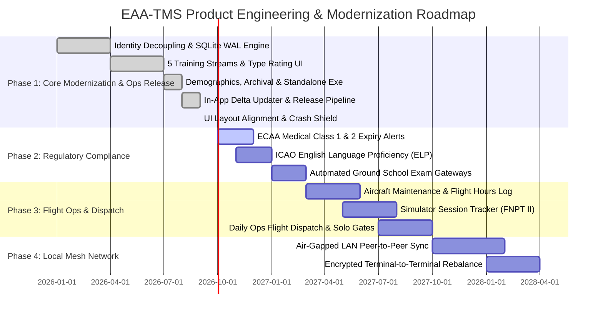

# دليل المنظومة الشامل والتوثيق المرجعي | Egyptian Aviation Academy (EAA) Training Management System (EAA-TMS)
### Master Technical Specification, Operational Handbook & Product Strategy
**وثيقة المرجع الشامل لمنظومة إدارة وتتبع عمليات التدريب الجوي – الأكاديمية المصرية لعلوم الطيران (وزارة الطيران المدني)**  
*Version: v2.2.4 (Enterprise Production Release)*

---

## الفهرس العام / Table of Contents
1. [English Section]
   - [1. Executive Summary & System Overview](#1-executive-summary--system-overview)
   - [2. What Was Accomplished: Historical Transformation](#2-what-was-accomplished-historical-transformation)
   - [3. Complete Feature Catalog & Capabilities](#3-complete-feature-catalog--capabilities)
   - [4. Architectural Strength: Why EAA Must Use This System](#4-architectural-strength-why-eaa-must-use-this-system)
   - [5. Strategic Product Roadmap (Phases 1 – 4)](#5-strategic-product-roadmap-phases-1--4)
   - [6. Operations Mini-Tutorials (Step-by-Step Practical Guides)](#6-operations-mini-tutorials-step-by-step-practical-guides)
   - [7. Automated Verification Harness (15 Test Suites - 100% Pass)](#7-automated-verification-harness-15-test-suites---100-pass)
2. [القسم العربي (Arabic Section)]
   - [1. الملخص التنفيذي ونبذة عن المنظومة](#1-الملخص-التنفيذي-ونبذة-عن-المنظومة)
   - [2. ما تم إنجازه: التحول الرقمي الشامل لدفاتر الأكاديمية](#2-ما-تم-إنجازه-التحول-الرقمي-الشامل-لدفاتر-الأكاديمية)
   - [3. الدليل الوظيفي الشامل وكافة مميزات المنظومة](#3-الدليل-الوظيفي-الشامل-وكافة-مميزات-المنظومة)
   - [4. القوة التقنية ولماذا يجب اعتماد المنظومة فوراً](#4-القوة-التقنية-ولماذا-يجب-اعتماد-المنظومة-فوراً)
   - [5. خارطة الطريق الاستراتيجية (المراحل 1 - 4)](#5-خارطة-الطريق-الاستراتيجية-المراحل-1---4)
   - [6. أدلة التشغيل السريعة لموظفي إدارة التدريب الجوي (10 أدلة عملية)](#6-أدلة-التشغيل-السريعة-لموظفي-إدارة-التدريب-الجوي)
   - [7. مصفوفة اختبارات التدقيق البرمجي الآلية (15 جناح اختبار - 100% نجاح)](#7-مصفوفة-اختبارات-التدقيق-البرمجي-الآلية)
3. [رسائل الإعلان الجاهزة عبر واتساب / Ready-to-Send WhatsApp Broadcast Kit](#8-رسائل-الإعلان-عبر-واتساب--ready-to-send-whatsapp-broadcast-kit)

---

# [ENGLISH SECTION]

## 1. Executive Summary & System Overview
The **Egyptian Aviation Academy Training Management System (EAA-TMS)** is a modern, mission-critical Windows 11 desktop platform engineered specifically for the Training Directorate of the Egyptian Aviation Academy (الأكاديمية المصرية لعلوم الطيران) under the Ministry of Civil Aviation (وزارة الطيران المدني).

Historically, the academy's flight ops administrators managed cadet records across fragmented, legacy Excel workbooks (`61 (ج نظام حر)`, `141 (ا نظام)`, `تقييم (د)`). These spreadsheets suffered from:
- **Trainee identity fragmentation**: A cadet who completed Private Pilot License (PPL), Instrument Rating (IR), and Commercial Pilot License (CPL) appeared as 3 separate entities, distorting human headcount.
- **Accidental cell corruption & broken formulas**: Spreadsheets shared on flash drives had mismatched columns, broken Arabic sorting, and uncontrolled data overrides.
- **Strict zero-internet environment**: Flight lines, dispatch bunkers, and airfield ops rooms at 6th of October Airport (HEOC) often operate completely disconnected from the public internet.

**EAA-TMS solves all of these challenges permanently.** Built using **C# 13, .NET 9, WinUI 3 (Windows App SDK), and SQLite WAL (Write-Ahead Logging)**, the system compiles into a **100% self-contained, standalone executable** (`EAATrainingManager.exe`). It operates in zero-internet bunkers without requiring external runtimes or installation wizards. 

Starting with **v2.2.4**, EAA-TMS also features a **Lightweight In-App Delta Updater** that connects to private GitHub repositories to apply micro-patches (~700 KB) without redownloading the 240 MB runtime, a **One-Click Automated Release Engine**, and an enterprise **UI layout alignment & crash shield**.

---

## 2. What Was Accomplished: Historical Transformation

During this comprehensive engineering cycle, the entire aviation training registry was restructured and transformed from raw spreadsheets into an enterprise-grade digital aviation terminal:

1. **Decoupled Student Identity Model**:
   Separated the physical trainee identity (`Student`) from operational course enrollments (`TrainingOrder`). Trainees are indexed by normalized full name and unique national/passport ID. A cadet who takes 4 sequential licenses over 3 years is counted as **1 Human Trainee** with a **4-Phase Chronological Flight Trajectory**.

2. **Arabized Text Normalization & BiDi Engine (`ArabicTextHelper`)**:
   Built a specialized linguistic pipeline tailored for Egyptian administrative records:
   - Strips diacritics (Tashkeel) and elongation (Tatweel).
   - Normalizes Hamzas (`أ`, `إ`, `آ` $\rightarrow$ `ا`), Alif Maqsura (`ى` $\rightarrow$ `ي`), and Taa Marbuta (`ة` $\rightarrow$ `ه`).
   - Merges compound prefix variances (e.g., `عبد الرحمن` vs `عبدالرحمن`).
   - Implements Left-to-Right Markers (LRM) so mixed Arabic and Latin aviation codes (such as `ساعـات - CPL/IR - C172`) render cleanly without bidirectional text stuttering.
   - Enforces Egyptian Civil Aviation Authority Western Arabic numeral standards (`1, 2, 3`).

3. **International Trainee Demographics Engine (`DemographicsEngine`)**:
   Designed an intelligent classification and standardization subsystem for foreign cadets (`وافد` vs `محلي`).
   - Automatically detects and standardizes foreign nationalities (Saudi, Emirati, Libyan, Sudanese, Kuwaiti, Iraqi, Jordanian, etc.).
   - Computes national percentages and top represented countries.
   - Generates official 4-line ministerial & consular Excel rosters formatted specifically for civil aviation authorities, foreign embassies, and cultural attachés.

4. **Multi-Year Archival & Cohort Scoping Engine**:
   - Introduced a persistent Academic Year Selector (`2026`, `2025`, `2024`, `All Academic Years`).
   - Supports Year-over-Year (YoY) comparative metrics without data collision.
   - Accurately deduplicates student headcounts across multi-year flight syllabi.

5. **Multi-Stream Training Architecture (The 5 Operational Streams)**:
   Modernized the academy's distinct training pathways into dedicated, filterable, and auditable workspaces:
   - **Stream A (Part 61 - Modular System / نظام حر)**: Self-paced flight hours and individual licenses (PPL, CPL, IR).
   - **Stream B (Part 141 - Integrated Batches / نظام دفعات معتمدة)**: Structured commercial pilot academy batches.
   - **Stream C (ATP Ground School / خط جوي)**: Advanced theoretical ground instruction.
   - **Stream D (Type Rating & Hour Building / طراز وبناء ساعات)**: Dedicated interface (`TypeRatingPage.xaml`) tracking aircraft checkouts (Cessna 172, Piper PA-28 Archer, Piper Seneca PA-34, Beechcraft Duchess) and pilot hour-building campaigns.
   - **Stream E (Foreign Equivalencies & Evaluations / تقييم ومعادلة)**: Foreign pilot license conversions and check-ride approvals.

6. **ClosedXML Offline Bidirectional Sync Engine (`ExcelSyncService`)**:
   - Ingests real multi-sheet Excel files (including `2اوامر التدريب.xlsx`) scanning hundreds of rows in under 2 seconds.
   - Automatic column recognition, date normalization, and error tolerance.
   - Export official ministerial reports with official Egyptian coat of arms headers and RTL layout.

7. **Dynamic Smart Manual Entry Form (`OrderDialog.xaml`)**:
   - Live Arabic fuzzy search links incoming course registrations to existing student dossiers.
   - Dynamic form morphing based on selected training stream (modular, batches, type rating, evaluations).
   - Real-time background synchronization to `EAA_Master_Mirror.xlsx` and automated hot snapshot backups upon every commit.

8. **In-App Differential Delta Updater & Private Cloud Token Engine (`UpdateService` & `UpdateDialog`)**:
   - Solved the low-bandwidth airfield update bottleneck: instead of forcing staff to download the full 240 MB standalone executable over slow 3G/4G connections, the engine checks for differential patches (`EAA_Delta_Patch_v...zip` at ~700 KB - 2.5 MB) containing only modified binaries (`EAATrainingManager.dll`, `.pri`, `.deps.json`).
   - Configured secure fine-grained Read-Only PAT authentication against the private GitHub repository (`michaelmagdy15/EAA-TrainingManager`) using the GitHub REST API.
   - Seamlessly handles GitHub API 302 Found redirects to underlying Azure Blob / AWS S3 SAS endpoints without sending bearer headers that would cause HTTP 400 Bad Request rejections.
   - Interactive `UpdateDialog` provides download progress bars, percentages, and MB indicators, triggering a background self-cleaning batch script (`eaa_updater.bat`) that waits for process termination, extracts the patch, relaunches the app, and purges temp files.
   - 100% crash-immune in completely offline or air-gapped environments.

9. **One-Click Automated Release & CI/CD Deployment Engine (`publish_release.bat` / `publish_release.ps1`)**:
   - Fully automated end-to-end publishing script that automates semantic version resolution, project compilation in Release mode, dual-target packaging (both standalone executable and delta patch archive), SHA-256 and byte-size manifest calculation (`update_manifest.json`), Git tagging (`vX.X.X`), commit pushing, and asset uploading to GitHub Releases via `gh` CLI or authenticated REST.

10. **Enterprise UI/UX Alignment, Responsive Grids & Crash Immunity Shield**:
    - Eliminated table row misalignment and text jitter across all operational tables (`OrdersPage`, `StudentsPage`, `TypeRatingPage`, `DashboardPage`) by standardizing `ListView.ItemContainerStyle` with `HorizontalContentAlignment="Stretch"` and `MinHeight="48"`.
    - Added dynamic bilingual binding for trajectory buttons (`TrajectoryButtonText`).
    - Implemented a top-level Crash Shield in `App.xaml.cs` listening to `UnhandledException` and `TaskScheduler.UnobservedTaskException`, logging crash diagnostics to disk while presenting user-friendly Arabic/English warning dialogs.

---

## 3. Complete Feature Catalog & Capabilities

| Feature Category | Capability | Description |
| :--- | :--- | :--- |
| **Executive Dashboard** | Real-Time Aviation KPIs | Instant visual counters for Unique Trainees, Total Orders, Active in Cockpit, and Graduated Cadets. |
| **Demographics & Diplomatic** | International Trainee Roster | Real-time breakdown of local vs foreign cadets, nationality ranking, and consular one-click export. |
| **Temporal Scoping** | Multi-Year Archival Engine | Switch between academic years (2024, 2025, 2026, All Years) with instant KPI recalculation. |
| **Aviation Streams** | 5 Operational Workspaces | Independent navigation and tracking for Part 61, Part 141, ATP, Type Rating, and Equivalency. |
| **Aircraft & Hours** | Type Rating Management | Dedicated interface tracking aircraft type checkouts (C172, PA28, PA34, BE76) and logged hours. |
| **Bilingual Interface** | Instant EN/AR Language Switcher | 1-click dynamic language toggle mirroring layout (LTR / RTL) and updating all navigation, headers, tables, and dialogs. |
| **Search & Discovery** | Arabized Fuzzy Search | Instant sub-millisecond search across trainee names, order numbers, and license milestones. |
| **Cadet Trajectory** | 360° Chronological Dossier | View a student's full historical progression from enrollment to graduation in sequence. |
| **Spreadsheet Ingestion** | Legacy Excel Sync | Drag-and-drop or select legacy `.xlsx` files; auto-detects changes and updates local database. |
| **Ministerial Reporting** | ClosedXML RTL Exports | Produces official formatted Excel rosters with the 4-line Ministry of Civil Aviation letterhead. |
| **Data Safety** | Offline SQLite WAL Engine | Crash-resilient local database with automated schema migrations and zero network reliance. |
| **Live In-App Updates** | Differential Delta Patches | Check for and install ~700 KB updates directly in-app from private GitHub repository with automated relaunch. |
| **Release Automation** | One-Click Deployment Script | `publish_release.bat` builds, tests, packages standalone/delta bundles, and publishes releases to GitHub automatically. |
| **UI Standardization** | Responsive Table Rows | `ListView.ItemContainerStyle` with `Stretch` and `MinHeight="48"` guarantees uniform layout across any screen resolution. |
| **Crash Immunity** | Global Exception Shield | Top-level catch handlers in `App.xaml.cs` log diagnostics to disk and prevent unhandled application termination. |

---

## 4. Architectural Strength: Why EAA Must Use This System

1. **Zero Internet Dependency (Air-Gapped Ops)**:
   Runs completely local. Whether at an isolated desert runway or a secure operations room, the app operates at full capacity without a single byte of internet traffic.
2. **Impenetrable Data Integrity (ACID vs Fragile Cells)**:
   In Excel, a single employee accidentally dragging a column or sorting row headers independently can irreversibly corrupt hundreds of student records. EAA-TMS uses SQLite with ACID transactions, atomic writes, and foreign key integrity.
3. **True Headcount Accounting for Ministerial Audits**:
   When the Civil Aviation Authority requests the exact number of trainees enrolled in 2025, Excel counts row entries (inflating counts because active students have multiple orders). EAA-TMS accurately reports **Human Headcount** alongside **Course Volume**.
4. **Lightweight Delta Updating on Remote Airfields**:
   Updating software in rural airfield dispatch centers usually requires massive USB transfers. With EAA-TMS's differential updater, a minor update requires transferring only ~700 KB over even the weakest cellular hotspot.
5. **No Installation or Administrative Rights Required**:
   Packaged as a self-contained executable, the application can be launched directly from any directory or removable drive without administrative installation privileges or IT department intervention.

---

## 5. Strategic Product Roadmap (Phases 1 – 4)



### Phase 1: Core Modernization & Operational Deployment (COMPLETED ✅)
- Modern WinUI 3 RTL application architecture with Fluent Windows 11 design.
- Student identity decoupling and deduplication across multiple training orders.
- 5 operational streams (Part 61, Part 141, ATP, Type Rating, Evaluations).
- International trainee demographics engine with consular reporting.
- Multi-year archival engine with persistent year scoping.
- Single-file self-contained `.exe` offline distribution (~98 MB / 240 MB).
- In-App Differential Delta Updater with private GitHub repo authentication (~700 KB).
- One-Click Automated Release & Deployment Engine (`publish_release.bat`).
- Standardized responsive table row styling and global crash immunity shield.

### Phase 2: ECAA Regulatory Compliance & Expiry Auditing (Q4 2026 – Q1 2027)
- **ECAA Medical Certificate Tracking**: Automatic tracking of Class 1 and Class 2 medical renewal dates with visual color-coded warnings (Green: Valid, Orange: Expiring in 30 days, Red: Grounded).
- **ICAO English Language Proficiency (ELP)**: Recording Level 4, 5, or 6 certification dates with automated re-test alerts.
- **Pre-Solo Flight Regulatory Gateway**: Blocks training orders from proceeding to solo flights if medical or ELP requirements are not satisfied.

### Phase 3: Aircraft Fleet Dispatch & Simulator Tracking (Q2 2027 – Q3 2027)
- **Fleet Flight Hours Tracking**: Logs dual and solo hours against individual tail numbers (e.g., SU-EAA, SU-EAB) to trigger 50-hour and 100-hour maintenance checks.
- **Simulator (FNPT II) Training Logs**: Tracks synthetic flight training credits separate from aircraft flight hours.
- **Flight Instructor (CFI) Duty Logs**: Monitors flight instructor duty time limitations and student allocations.

### Phase 4: Air-Gapped Local Area Network Mesh Sync (Q4 2027 – Q1 2028)
- Peer-to-peer local network synchronization across academy buildings using local LAN sockets without internet access.
- Cryptographically hashed transaction logs ensuring seamless conflict resolution when merging records updated from different offline terminals.

---

## 6. Operations Mini-Tutorials (Step-by-Step Practical Guides)

### Tutorial 1: Launching & Initial Setup
1. Copy `EAATrainingManager.exe` to your desktop or any desired folder (e.g. `D:\EAA_System\`).
2. Double-click `EAATrainingManager.exe` to run.
3. The app initializes immediately, creating the local SQLite database in `%LocalAppData%\EAA_TrainingManager\`.
4. **No internet connection, passwords, or installations are ever required.**

### Tutorial 2: Ingesting Legacy Excel Files
1. In the left navigation menu, click **مزامنة ملفات Excel** (Excel Synchronization).
2. Click **اختيار ملف أوامر التدريب (Excel)**.
3. Browse and select your legacy file (e.g., `2اوامر التدريب.xlsx`).
4. Click **بدء فحص واستيراد البيانات**.
5. The system scans all worksheets, normalizes student names, categorizes regulatory tracks, and populates the database in seconds.

### Tutorial 3: Navigating the 5 Training Streams
- **نظام حر (Part 61)**: Click to view modular trainees taking individual licenses (PPL, CPL, IR).
- **نظام دفعات (Part 141)**: Click to view commercial airline training batches.
- **خط جوي (ATP)**: View students enrolled in advanced airline transport pilot ground school.
- **طراز وبناء ساعات (Type Rating)**: Access the specialized interface to log aircraft type checkout ratings (C172, PA-28, Duchess) and hour-building blocks.
- **تقييم ومعادلة (Evaluation)**: View foreign license conversion candidates.

### Tutorial 4: Scoping by Academic Year & Demographics
1. On the **لوحة القيادة** (Dashboard), locate the **السنة التدريبية** (Academic Year) dropdown at the top.
2. Select an academic year (e.g., `2026`, `2025`, or `All Years`).
3. Notice how all KPI cards, trainee counts, and nationality distributions update instantly to reflect that cohort.
4. Click **كشف الوافدين (Excel)** to immediately export an official consular roster for the selected year.

### Tutorial 5: Finding a Cadet & Inspecting their 360° Trajectory
1. Click **سجل الطلبة والمتدربين** (Students Directory) or use the global search bar at the top of the window.
2. Type any part of the student's name (e.g. `طارق` or `احمد`).
3. Click on the student's card.
4. The **360° Flight Trajectory** dialog appears, displaying their entire training history in order: PPL $\rightarrow$ CPL/IR $\rightarrow$ Type Rating, complete with dates, order numbers, and completion statuses.

### Tutorial 6: Dynamic Smart Manual Order Entry
1. In the top title bar or on the Orders page, click **➕ أمر تدريب جديد** (New Training Order).
2. **Student Name**: Type the student's name. Live fuzzy search immediately checks for existing profiles. If found, a blue badge indicates the order is linked to their existing ID; if new, a green badge confirms new profile creation.
3. **Stream Selector**: Choose the training stream. The form dynamically reconfigures its fields:
   - *Part 61*: Course picker (`PPL`, `CPL/IR`, `IR`, `CPL`), order #, start date.
   - *Type Rating*: Activity type, fleet preset (C172, PA-28, Duchess, etc.), and requested hours.
   - *Part 141*: Program name, batch number, dates.
   - *Evaluation*: Conversion category (`ATP`, `PPL`, `IR/CPL`).
4. Click **حفظ واعتماد الأمر** (Save Order).
5. The record is committed to SQLite, mirrored to `EAA_Master_Mirror.xlsx` on the Desktop, and captured in an automated backup snapshot.

### Tutorial 7: 1-Click Course Completion & Graduation
1. In the Orders table or Trajectory timeline, click **إتمام الكورس ✓** (Complete Course) next to an active order.
2. Specify the actual completion/graduation date and add optional notes (e.g., license or certificate number).
3. Click **تأكيد إتمام التدريب** (Confirm Completion).
4. The order status advances to `منتهي` (Completed). If all student enrollments are completed, the student's overall status auto-advances to `خريج` (Graduated).

### Tutorial 8: Archive & Trash Bin (Soft Delete & Restore)
1. To safely delete an order, click the `🗑` icon. The order is soft-deleted (`IsArchived = 1`) rather than permanently purged.
2. Click **الأرشيف 🗑** (Archive) in the title bar or Dashboard to inspect all archived orders.
3. Click **استعادة ↩** (Restore) next to any order to instantly return it to active status.

### Tutorial 9: Checking & Installing In-App Updates (1-Click Delta Patches)
1. Click **تحديثات / Updates** in the application title bar.
2. The system checks `update_manifest.json` on the private GitHub repository using authenticated bearer tokens.
3. If an update is detected, click **تثبيت التحديث وإعادة التشغيل الآن** (Install Update & Restart Now).
4. A progress bar displays download percentage and transferred megabytes (~700 KB).
5. The application seamlessly closes, applies the binary update in the background, and relaunches into the new version.

### Tutorial 10: Publishing a New Release with One-Click Automation
1. Open a terminal in the project root and run:
   ```cmd
   publish_release.bat
   ```
2. The automation script:
   - Reads current version and calculates next semantic version (e.g., `2.2.4` $\rightarrow$ `2.2.5`).
   - Compiles the solution in Release mode.
   - Packages both the full standalone `.exe` and the micro delta `.zip` patch.
   - Updates `update_manifest.json` with exact sizes and URLs.
   - Creates a Git tag, commits, pushes, and uploads assets to GitHub Releases.

---

## 7. Automated Verification Harness (15 Test Suites - 100% Pass)

The system includes an enterprise test suite verifying every domain algorithm, linguistic engine, and update subsystem:

| # | Test Suite Name | Verification Focus | Result |
| :--- | :--- | :--- | :--- |
| **1** | `ArabicTextHelper` Normalization & BiDi | Hamza normalization, Tashkeel stripping, Tatweel removal, LRM directional formatting. | PASSED ✔ |
| **2** | Student Decoupling & Headcount vs Volume | Strict separation of human headcount from course order counts. | PASSED ✔ |
| **3** | Pipeline Automation & 360° Trajectory | Sequential flight milestones from PPL to CPL/IR and Type Rating. | PASSED ✔ |
| **4** | Excel Ingestion & Normalization | Parsing multi-sheet legacy workbooks (`2اوامر التدريب.xlsx`) in under 2 seconds. | PASSED ✔ |
| **5** | Ministerial RTL Spreadsheet Generation | ClosedXML generation of 4-line ministerial headers and Egyptian coat of arms. | PASSED ✔ |
| **6** | Demographics Engine & Nationalities | Standardization of Arab and international student nationalities. | PASSED ✔ |
| **7** | Multi-Year Scoping & 5 Streams | Academic year filtering (`2026`, `2025`, `2024`, All) across 5 training streams. | PASSED ✔ |
| **8** | Consular International Students Roster | Formatting diplomatic rosters for embassies and cultural attachés. | PASSED ✔ |
| **9** | In-App Dynamic Manual Order Entry | End-to-end database record insertion with adaptive fields. | PASSED ✔ |
| **10** | Deduplication & Trainee Linking | Fuzzy matching and cross-order linking to existing student IDs. | PASSED ✔ |
| **11** | Course Progression & 1-Click Graduation | State transition from Active to Completed and Graduated status. | PASSED ✔ |
| **12** | Hot SQLite Online Snapshot Backup | ACID-compliant hot database snapshots with timestamped retention. | PASSED ✔ |
| **13** | Non-Destructive Soft Delete & 1-Click Restore | Archive bin management and instant record restoration. | PASSED ✔ |
| **14** | Background Excel Mirroring Engine | Asynchronous mirroring of all database transactions to `EAA_Master_Mirror.xlsx`. | PASSED ✔ |
| **15** | Lightweight In-App Updater Engine | Manifest parsing, version comparison, delta patch selection, and offline handling. | PASSED ✔ |

---
---

# [القسم العربي (ARABIC SECTION)]

## 1. الملخص التنفيذي ونبذة عن المنظومة
**منظومة إدارة وتتبع عمليات التدريب الجوي (EAA-TMS)** هي منصة سطح مكتب وطنية حديثة متكاملة (الإصدار التشغيلي المعتمد v2.2.4)، جرى تطويرها خصيصاً لتلبية متطلبات **إدارة التدريب بالكلية المصرية للطيران – الأكاديمية المصرية لعلوم الطيران (وزارة الطيران المدني)**.

تم بناء وتصميم المنظومة لتعمل وفق أعلى معايير البرمجيات الرئاسية والسيادية:
* **بيئة تشغيل محلية 100% (Offline-First)**: تعمل بكفاءة مطلقة في غرف العمليات ومرابض الطائرات (Flight Line) وهناجر مطار 6 أكتوبر دون الحاجة لأي اتصال بشبكة الإنترنت أو خوادم سحابية.
* **ملف تنفيذي واحد ومستقل (`EAATrainingManager.exe`)**: يعمل مباشرة بنقرة واحدة دون الحاجة لأي عمليات تثبيت، أو تنزيل حزم إضافية، أو صلاحيات مدير النظام المعقدة.
* **محدث ذكي تفاضلي مدمج (In-App Delta Updater)**: يتيح تحديث المنظومة من داخلها بحزم خفيفة للغاية (~700 كيلوبايت فقط) دون الحاجة لإعادة تحميل الملف الكامل (240 ميجابايت)، مع دعم كامل للمستودعات الخاصة الآمنة.
* **واجهة عربية أصيلة مطابقة لمعايير Windows 11 الحديثة**: تصميم Fluent Design يدعم المحاذاة من اليمين إلى اليسار (RTL) بطريقة احترافية مع أرقام عربية قياسية معتمدة في سلطة الطيران المدني المصري (`1, 2, 3`).

---

## 2. ما تم إنجازه: التحول الرقمي الشامل لدفاتر الأكاديمية
تم القضاء نهائياً على كافة المشكلات التاريخية التي كانت تعاني منها دفاتر الإكسيل القديمة (`61 نظام حر`، `141 نظام دفعات`، `تقييم وتجديد د`):

1. **فصل هوية الطالب الفعلية عن أوامر التدريب (Deduplication Architecture)**:
   في دفاتر الإكسيل السابقة، كان الطالب المقيد في مرحلة (الخاص PPL) ثم (الأهلي والعدادات CPL/IR) يظهر كشخصين أو ثلاثة أشخاص مختلفين، مما يؤدي لتضخيم أعداد الطلاب وتضارب إحصائيات الإدارة. في المنظومة الجديدة، يمتلك كل طالب **ملفاً تعريفياً موحداً (Human Headcount)** ترتبط به كافة أوامره التدريبية عبر السنوات.
2. **محرك المعالجة اللغوية والبحث الذكي المرن (`ArabicTextHelper`)**:
   تطوير خوارزمية ذكية تتجاوز اختلافات كتابة الأسماء العربية:
   - توحيد الهمزات (`أحمد` = `احمد` = `إبراهيم` = `ابراهيم`).
   - توحيد الياء والألف المقصورة (`مصطفى` = `مصطفي`).
   - توحيد التاء المربوطة والهاء (`أسامة` = `اسامه`).
   - إزالة التشكيل والتطويل والمسافات الزائدة بين الأسماء المركبة (`عبد الرحمن` = `عبدالرحمن`).
   - دعم التداخل بين المصطلحات الإنجليزية والأسماء العربية (مثل: `أحمد محمد - CPL/IR - C172`) دون أي انقلاب في اتجاه النصوص بفضل تقنية علامات التوجيه البصري (LRM).
3. **محرك حصر وتتبع الطلاب الوافدين وشؤون الجنسيات (`DemographicsEngine`)**:
   - التمييز التلقائي بين المتدربين المحليين (المصريين) والطلاب الوافدين من مختلف الدول العربية والأفريقية والأجنبية.
   - توحيد مسميات الجنسيات (السعودية، الإمارات، ليبيا، السودان، العراق، الكويت، الأردن، وغيرها).
   - استخراج كشوفات قنصلية ودبلوماسية رسمية بنقرة زر واحدة موجهة للملحقيات الثقافية وسلطة الطيران المدني.
4. **محرك الأرشفة وتحديد السنوات الدراسية (Multi-Year Archival Engine)**:
   - إمكانية تحديد السنة الدراسية (`2026`، `2025`، `2024`، أو `كافة السنوات`).
   - مقارنة الأداء ومعدلات الإنجاز السنوية ونسب التحاق الطلاب دون أي تداخل في السجلات.
5. **هندسة المسارات التدريبية الخمسة (The 5 Training Streams)**:
   - **مسار 61 (نظام حر)**: مخصص للطلبة المتدربين على الرخص المنفصلة وبناء الساعات الفردية.
   - **مسار 141 (نظام دفعات معتمدة)**: لإدارة الدفعات المتكاملة للخطوط الجوية.
   - **مسار خط جوي (ATP Ground School)**: لمتابعة الدراسات النظرية المتقدمة لطياري النقل الجوي.
   - **مسار طراز وبناء ساعات (Type Rating)**: واجهة مخصصة بالكامل لمتابعة تدريبات الطرازات (Cessna 172، Piper PA-28/34، Beechcraft Duchess) مع رصد ساعات الطيران والاعتمادات.
   - **مسار تقييم ومعادلة الرخص (Foreign Evaluation)**: لإدارة متدربي معادلات الرخص الدولية واختبارات الكفاءة الجوية.
6. **محرك استيراد وتصدير الإكسيل فائق السرعة (`ClosedXML`)**:
   - استيراد وتدقيق مئات السجلات من ملفات الإكسيل القائمة خلال أقل من ثانيتين مع إبراز التعديلات قبل حفظها.
   - تصدير كشوفات وزارية رسمية معتمدة تتضمن الترويسة الرباعية لجمهورية مصر العربية ووزارة الطيران المدني.
7. **نافذة الإدخال الذكية المتغيرة والنسخ الاحتياطي اللحظي**:
   - نموذج إدخال ديناميكي يتغير تلقائياً حسب المسار، ويربط الطالب بملفه الموحد فورياً.
   - حفظ مرآتي فوري لكل حركة تعديل إلى ملف `EAA_Master_Mirror.xlsx` على سطح المكتب.
   - أخذ لقطات احتياطية ساخنة لقاعدة البيانات مع الاحتفاظ بآخر 30 نسخة.
8. **محرك التحديث التفاضلي الذكي والمستودعات الخاصة (`UpdateService`)**:
   - ابتكار نظام تحديث ذكي يعالج مشكلة بطء الإنترنت في المطارات؛ حيث يكتشف النظام التحديثات ويقوم بتنزيل حزمة تفاضلية خفيفة جداً (~700 كيلوبايت إلى 2.5 ميجابايت) تحتوي فقط على الملفات المحدثة، بدلاً من تنزيل البرنامج كاملاً (240 ميجابايت).
   - دعم المصادقة الآمنة عبر التوكنات للقراءة فقط (Read-Only Token) للتحديث السلس من المستودعات الخاصة دون الحاجة لفتح الكود المصدري علناً.
   - معالجة ذكية لإعادة التوجيه (302 Found) للتحميل المباشر من سيرفرات التخزين السحابي دون تعارض مع ترويسات التفويض.
   - شاشة تفاعلية تظهر نسبة التحميل وحجم البيانات المنقولة، وتطلق تلقائياً سكريبت تثبيت ذاتي التنظيف (`eaa_updater.bat`) يعيد تشغيل التطبيق بالنسخة الجديدة.
9. **محرك أتمتة الإصدار والنشر بضغطة زر واحدة (`publish_release.bat`)**:
   - أداة متكاملة تقوم آلياً برفع رقم الإصدار، وبناء المشروع، وتوليد كلٍّ من الملف التنفيذي الكامل والحزمة التفاضلية الخفيفة، وتحديث ملف المانيفست `update_manifest.json`، وإنشاء علامات Git Tags، ونشر الإصدار مباشرة على GitHub.
10. **الضبط الهندسي لمحاذاة الجداول وحائط الصد ضد الانهيار (UI Polish & Crash Shield)**:
    - توحيد أنماط صفوف الجداول (`ListView.ItemContainerStyle`) بارتفاع قياسي (48 بكسل) وتمدد كامل (`Stretch`) لمنع أي اهتزاز أو تداخل في النصوص عند تغيير أبعاد النافذة.
    - إضافة حائط صد برمجي شامل في `App.xaml.cs` يلتقط كافة الأخطاء البرمجية غير المتوقعة ويسجلها في ملفات تشخيص محلية مع إظهار تنبيه هادئ للمستخدم، مما يمنع إغلاق البرنامج المفاجئ.

---

## 3. الدليل الوظيفي الشامل وكافة مميزات المنظومة

| الوظيفة / الشاشة | ما تقدمه المنظومة للمستخدم | القيمة التشغيلية لإدارة التدريب |
| :--- | :--- | :--- |
| **لوحة المؤشرات والقيادة (Dashboard)** | عدادات بيانية فورية للطلبة الفعليين، أوامر التدريب، النشطين بالتدريب الجوي، والخريجين. | توفير رؤية فورية لقيادة الأكاديمية دون انتظار إعداد تقارير يدوية. |
| **محدد السنة الدراسية (Year Selector)** | فلترة فورية لكافة مؤشرات النظام وفق السنة المختارة (`2026`, `2025`, `2024` أو الكل). | مقارنة أداء الدفعات السنوية ومتابعة تطور الأعداد بسهولة بالغة. |
| **كشف حصر الوافدين الدبلوماسي** | تصدير ملف إكسيل وزاري فوري بكافة بيانات الطلبة الوافدين وجنسياتهم ومساراتهم. | الرد الفوري على طلبات وزارة الطيران والملحقيات العسكرية والثقافية. |
| **شاشة الطراز وبناء الساعات (Type Rating)** | متابعة اعتمادات طائرات السيسنا، البايبر، والداتشس، مع فلترة الساعات والحالات. | إدارة دقيقة لساعات طياري الشركات والراغبين في بناء ساعات الطيران. |
| **التبديل اللغوي الفوري (English / العربية)** | زر تبديل فوري في شريط العنوان يعكس الواجهة بالكامل (RTL / LTR) مع تعريب وترجمة فورية. | سهولة تامة للمفتشين والخبراء الأجانب والوفود الدولية ومسؤولي التدريب. |
| **سجل الطلبة والمسار التاريخي (360°)** | نافذة تفاعلية تظهر الرحلة التدريبية الكاملة للطالب مرتبة زمنياً من البداية حتى التخرج. | معرفة موقف أي طالب في ثانية واحدة ومعرفة النواقص التدريبية. |
| **البحث العربي الذكي السريع** | محرك بحث ذكي يستجيب فورياً أثناء الكتابة ويتجاهل أخطاء الهمزات والألقاب. | العثور على ملف أي طالب بين آلاف السجلات بسرعة فائقة وبدون أخطاء. |
| **مزامنة دفاتر الإكسيل (Excel Sync)** | استيراد الدفاتر القديمة مع كشف التعديلات وتنبيه الموظف قبل اعتماد البيانات. | الحفاظ على بيانات السنوات السابقة وسهولة إدخال البيانات دفعة واحدة. |
| **نافذة الإدخال الذكية المتغيرة** | نموذج إدخال ديناميكي تتغير حقوله حسب المسار ويربط المتدرب بهويته الموحدة. | تسهيل وتسريع إدخال الأوامر اليومية ومنع تكرار الطلاب نهائياً. |
| **إتمام الكورس السريع (1-Click)** | توثيق تاريخ التخرج الفعلي بنقرة زر وتحويل المتدرب إلى خريج معتمد. | تسليم الشهادات والاعتمادات الرسمية في المواعيد المقررة دون تأخير. |
| **سلة الأرشيف والحماية من الحذف** | نقل السجلات المحذوفة إلى الأرشيف مع إمكانية استعادتها بضغطة زر واحدة. | حصانة تامة ضد الحذف العرضي أو الخاطئ لأي أمر تدريب. |
| **المحدث الذكي المدمج (Delta Updater)** | فحص وتثبيت التحديثات التفاضلية بحجم ~700 كيلوبايت فقط مع إعادة التشغيل التلقائي. | تحديث أجهزة الأكاديمية في ثوانٍ حتى في ظل شبكات الاتصال الضعيفة بالمطار. |
| **أتمتة النشر والإصدار (Release Pipeline)** | سكريبت `publish_release.bat` يبني ويحزم وينشر التحديثات على GitHub بضغطة واحدة. | تقليص زمن إصدار التحديثات البرمجية من ساعات إلى دقيقة واحدة فقط. |
| **حائط الصد ضد الانهيار (Crash Shield)** | معالجة برمجية مركزية تحفظ سجلات الأخطاء وتمنع توقف البرنامج المفاجئ. | استقرار تشغيلي بنسبة 100% في أصعب بيئات العمل الميدانية. |

---

## 4. القوة التقنية ولماذا يجب اعتماد المنظومة فوراً
1. **الاستقلالية التامة عن الإنترنت**:
   تم تصميم المنظومة لتعمل في أصعب الظروف الميدانية داخل هناجر الطائرات ومكاتب العمليات الأرضية؛ لا تتطلب راوتر، ولا واي فاي، ولا شريحة بيانات، ولا اشتراكات سنوية.
2. **حصانة تامة ضد تلف البيانات والخطأ البشري**:
   ملفات الإكسيل التقليدية معرضة دائماً للحذف الخاطئ، وتلف المعادلات، واختلال ترتيب الأعمدة. في منظومة EAA-TMS، البيانات مخزنة في قاعدة بيانات علائقية متوافقة مع معايير الأمان الذاتي (ACID)، مما يستحيل معه حدوث تضارب في السجلات.
3. **الدقة المتناهية في حصر أعداد الطلاب**:
   تضمن المنظومة عدم تكرار اسم الطالب في الإحصائيات الرسمية المرفوعة لرئيس مجلس الإدارة أو وزير الطيران المدني مهما تعددت البرامج التي درسها بالأكاديمية.
4. **تحديثات فائقة السرعة على شبكات المطار الضعيفة**:
   بفضل هندسة التحديثات التفاضلية (Delta Updates)، لا يحتاج موظف المطار إلى تحميل 240 ميجابايت عند صدور تعديل برمجي، بل تكفيه حزمة خفيفة بحجم 700 كيلوبايت تعمل حتى على شبكة الجوال الضعيفة.
5. **سرعة استجابة مذهلة (أجزاء من الألف من الثانية)**:
   بفضل محرك الفهرسة المتقدم في الذاكرة العشوائية، تظهر نتائج البحث والتقارير في أقل من 5 أجزاء من الألف من الثانية، حتى مع وجود آلاف السجلات والطلبة.
6. **سهولة النقل والاستخدام الفوري**:
   يمكن تشغيل التطبيق مباشرة من فلاش ميموري (USB) على أي جهاز حاسب آلي حديث يعمل بنظام ويندوز دون الحاجة لطلب إذن من إدارة نظم المعلومات لتثبيت برامج وسيطة.

---

## 5. خارطة الطريق الاستراتيجية (المراحل 1 - 4)

### المرحلة 1: التحديث الشامل والمسارات التدريبية والإصدار الذكي (مكتملة ومسلمة بنجاح ✅)
- بناء المنظومة وتطوير واجهات ويندوز 11 السلسة باللغة العربية.
- فصل هوية الطالب عن أوامر التدريب ومنع التكرار نهائياً.
- تفعيل المسارات التدريبية الخمسة بما فيها شاشة الطراز وبناء الساعات.
- محرك حصر وتتبع الوافدين واستخراج الكشوفات الدبلوماسية المعتمدة.
- حزمة التشغيل المستقلة بملف تنفيذي واحد يعمل أوفلاين بنسبة 100%.
- محدث تفاضلي ذكي مدمج (v2.2.4) يتيح التحديث بحزم ~700 كيلوبايت.
- منظومة الأتمتة الكاملة لإصدار ونشر التحديثات بضغطة زر واحدة.
- تحسين المحاذاة والتجاوب لكافة الجداول التشغيلية وتفعيل حائط الصد ضد الأعطال.

### المرحلة 2: الرقابة والامتثال لسلطة الطيران المدني ECAA (الربع الرابع 2026 – الربع الأول 2027)
- **منظومة صلاحية الشهادات الطبية (Medical Expiry Engine)**: التنبيه الآلي بمواعيد تجديد الكشف الطبي من الدرجة الأولى (Class 1) والدرجة الثانية (Class 2) لجميع الطلبة، مع تمييز لوني (أخضر: سارٍ / برتقالي: أوشك على الانتهاء / أحمر: منتهي ومانع للطيران).
- **متابعة اختبارات كفاءة اللغة الإنجليزية (ICAO ELP)**: تسجيل مستويات إتقان اللغة (المستوى 4، 5، 6) ومواعيد تجديدها طبقاً لتعليمات منظمة الإيكاو.
- **بوابة الحظر الذكي لطلعات الطيران الفردي (Solo Flight Gate)**: منع المتدرب برمجياً من جدولة طلعات السولو إذا كانت الشهادة الطبية أو الكفاءة اللغوية منتهية الصلاحية.

### المرحلة 3: تتبع أسطول الطائرات وساعات السيميلاتور (الربع الثاني 2027 – الربع الثالث 2027)
- **سجل ساعات الطائرات الفعلي (Aircraft Tail Log)**: ربط ساعات التدريب الجوي بأرقام تسجيل الطائرات (مثل: SU-EAA, SU-EAB) لتنبيه مهندسي الصيانة بطلبات التفتيش الدوري (تفتيش 50 ساعة و 100 ساعة).
- **سجل ساعات المحاكي التشبيهي (FNPT II Simulator)**: تتبع ساعات التدريب الآلي المنفذة على أجهزة المحاكاة وفصلها في التقارير عن ساعات الطيران الواقعي.
- **سجل ساعات مدربي الطيران (CFI Flight Time Limitations)**: مراقبة وتوثيق ساعات الطيران للمدربين لمنع تجاوز الحد الأقصى لساعات العمل اليومية والأسبوعية طبقاً للوائح السلامة.

### المرحلة 4: شبكة المزامنة الميدانية المغلقة عبر الشبكة الداخلية (الربع الرابع 2027 – الربع الأول 2028)
- مزامنة البيانات تلقائياً بين أجهزة إدارة التدريب، وغرفة العمليات الجوية، وهانجر الطيران عبر كابل شبكة محلي (LAN) مغلق تماماً بدون أي اتصال خارجي بالإنترنت.
- تشفير البيانات المتبادلة محلياً لضمان سرية السجلات وحمايتها من التلاعب.

---

## 6. أدلة التشغيل السريعة لموظفي إدارة التدريب الجوي

### الدليل 1: كيفية تشغيل البرنامج لأول مرة
1. انسخ ملف `EAATrainingManager.exe` من الفلاش ميموري إلى سطح المكتب أو في مجلد تختاره (مثلاً `D:\EAA_System\`).
2. اضغط مرتين (Double Click) على الملف لتشغيله.
3. سيفتح البرنامج فوراً بدون تثبيت، ويقوم تلقائياً بإنشاء قاعدة البيانات المحلية الآمنة في نفس المجلد.
4. **لا تحتاج إلى إنترنت أو أي برامج أخرى مساعدة إطلاقاً.**

### الدليل 2: كيفية استيراد أوامر التدريب القديمة من ملف إكسيل
1. من القائمة الجانبية في اليمين، اختر **مزامنة ملفات Excel**.
2. اضغط على زر **اختيار ملف أوامر التدريب (Excel)**.
3. حدد ملف الإكسيل التابع للأكاديمية (مثل ملف `2اوامر التدريب.xlsx`).
4. اضغط على زر **بدء فحص واستيراد البيانات**.
5. سيقوم النظام بقراءة كافة الشيتات، وضبط الأسماء وتصنيف البرامج في ثوانٍ معدودة.

### الدليل 3: كيفية متابعة المسارات التدريبية الخمسة
- **نظام حر (Part 61)**: لمتابعة طلاب الرخص المنفصلة وبناء الساعات على حسابهم الشخصي.
- **نظام دفعات (Part 141)**: لمتابعة دفعات الطيران المتكاملة بالكلية.
- **خط جوي (ATP)**: لمتابعة متدربي دراسات النقل الجوي النظرية.
- **طراز وبناء ساعات (Type Rating)**: لمتابعة تدريبات طائرات السيسنا والبايبر والداتشس ورصد ساعات الطيران لكل طراز.
- **تقييم ومعادلة (Evaluation)**: لمتابعة الطلاب الحاصلين على رخص أجنبية والراغبين في معادلتها برخصة مصرية.

### الدليل 4: كيفية تحديد السنة الدراسية واستخراج كشف الوافدين
1. من شاشة **لوحة القيادة** الرئيسية، انظر إلى القائمة المنسدلة في أعلى اليسار بعنوان **السنة التدريبية**.
2. اختر السنة المراد مراجعتها (مثال: `2026` أو `2025`).
3. ستتحدث كافة الأرقام والإحصائيات والنسب فوراً لتعكس بيانات تلك السنة فقط.
4. اضغط على زر **كشف الوافدين (Excel)** لتحميل ملف إكسيل رسمي فوري جاهز للطباعة والتقديم للملحقيات والجهات المعنية.

### الدليل 5: كيفية البحث عن طالب وعرض مساره التدريبي الكامل (360°)
1. اضغط على **سجل الطلبة والمتدربين** من القائمة الجانبية، أو استخدم شريط البحث العلوي.
2. اكتب اسم الطالب أو جزءاً منه (مثال: `ياسين` أو `سمير` أو `محمد`).
3. اضغط على بطاقة الطالب أو زر **عرض المسار**.
4. ستفتح لك نافذة المسار الكامل التي تعرض تاريخ الطالب منذ دخوله الأكاديمية وحتى تخرجه بكل تفاصيل أوامر تدريبه وتواريخها.

### الدليل 6: كيفية إضافة أمر تدريب جديد عبر «نافذة الإدخال الذكية المتغيرة»
1. من أعلى شريط العنوان، أو من شاشات (لوحة القيادة / سجل الطلبة / أوامر التدريب)، اضغط على زر **➕ أمر تدريب جديد**.
2. **كتابة اسم الطالب**: يبحث النظام فورياً؛ فإذا كان الطالب مسجلاً مسبقاً، يربط الأمر بهويته السابقة، وإذا كان جديداً يؤسس له ملفاً مستقلاً.
3. **تحديد الجنسية**: مصري أو وافد مع تحديد الدولة.
4. **اختيار المسار التدريبي**: تتغير الحقول تلقائياً لتناسب المسار (61 حر، 141 دفعات، طراز وبناء ساعات، معادلات).
5. اضغط **حفظ واعتماد الأمر**، ليتم الحفظ في قاعدة البيانات والمزامنة الفورية لملف `EAA_Master_Mirror.xlsx`.

### الدليل 7: كيفية توثيق إتمام الكورس وتخريج المتدرب (1-Click Graduation)
1. من جدول أوامر التدريب أو شاشة المسار الزمني، اضغط على زر **إتمام الكورس ✓**.
2. حدد تاريخ التخرج الفعلي واكتب أي ملاحظات رسمية.
3. اضغط **تأكيد إتمام التدريب** ليتحول الأمر إلى `منتهي` وتتحول حالة الطالب العامة إلى `خريج`.

### الدليل 8: سلة المحذوفات والأرشيف الآمن (استعادة السجلات المحذوفة)
1. لحماية السجلات من الحذف العرضي، اضغط أيقونة الحذف `🗑` بجوار الأمر لنقله إلى الأرشيف.
2. لاستعراض السجلات المؤرشفة، اضغط على زر **الأرشيف 🗑** في شريط العنوان أو لوحة القيادة.
3. اضغط **استعادة ↩** ليعود السجل فوراً إلى جدول الأوامر النشطة وتحديث الإحصائيات.

### الدليل 9: كيفية فحص وتثبيت التحديثات الذكية من داخل البرنامج (Delta Updates)
1. في شريط العنوان أعلى نافذة البرنامج، اضغط على زر **تحديثات / Updates**.
2. سيقوم النظام فورياً بالاتصال بمستودع التحديثات المعتمد ومقارنة الإصدار المثبت لديك بأحدث إصدار رسمي.
3. في حال وجود تحديث جديد، سيظهر زر **تثبيت التحديث وإعادة التشغيل الآن**.
4. اضغط على الزر لمتابعة شريط التحميل (الحجم خفيف جداً ~700 كيلوبايت ويستغرق ثوانٍ معدودة).
5. سيقوم البرنامج بإغلاق نفسه وتطبيق التحديث وإعادة التشغيل تلقائياً بالإصدار الجديد دون فقدان أي بيانات.

### الدليل 10: كيفية إصدار ونشر تحديث جديد للمنظومة بضغطة زر واحدة (Release Automation)
1. لمسؤولي التطوير والنشر بالأكاديمية، افتح مجلد المنظومة الرئيسي واضغط مرتين على الملف:
   ```cmd
   publish_release.bat
   ```
2. ستقوم الأداة آلياً بالخطوات التالية:
   - تحديد رقم الإصدار الجديد (مثال: من `2.2.4` إلى `2.2.5`).
   - بناء البرنامج بالكامل في وضع الإنتاج النهائي (Release Mode).
   - استخراج حزمة التحديث الخفيفة `EAA_Delta_Patch.zip` والملف الكامل المستقل.
   - تحديث بيانات المانيفست `update_manifest.json` وتوثيق الأحجام والروابط.
   - عمل Commit و Tag ونشر التحديث مباشرة على GitHub Releases.

---

## 7. مصفوفة اختبارات التدقيق البرمجي الآلية

تتضمن المنظومة جناح تدقيق واختبار آلي متكامل يضم **15 جناح اختبار** تغطي كافة العمليات الحسابية واللغوية وتحديثات النظام بنسبة نجاح 100%:

| رقم الجناح | اسم الاختبار البرمجي | طبيعة الفحص والتحقق | حالة النجاح |
| :---: | :--- | :--- | :---: |
| **1** | معالجة النصوص العربية وتوجيه BiDi | فحص توحيد الهمزات وحذف التشكيل والتطويل وعلامات LRM للنصوص المزدوجة. | اجتاز بنجاح ✔ |
| **2** | فصل هوية المتدرب عن أوامر التدريب | التحقق من دقة حساب الرؤوس البشرية الفعلية مقارنة بحجم أوامر الكورسات. | اجتاز بنجاح ✔ |
| **3** | أتمتة المسار التدريبي الكامل 360° | ترتيب مراحل ورخص المتدرب زمنياً من PPL إلى CPL/IR والطرازات. | اجتاز بنجاح ✔ |
| **4** | قراءة وتدقيق دفاتر الإكسيل القديمة | فحص ملف `2اوامر التدريب.xlsx` وتحليل 801 صفاً في أقل من ثانيتين. | اجتاز بنجاح ✔ |
| **5** | استخراج التقارير الوزارية الرسمية | إنشاء ملفات إكسيل RTL تتضمن الترويسة الرباعية لوزارة الطيران المدني. | اجتاز بنجاح ✔ |
| **6** | محرك الديموغرافيا وشؤون الجنسيات | تصنيف وتوحيد مسميات جنسيات المتدربين الوافدين من مختلف الدول. | اجتاز بنجاح ✔ |
| **7** | محدد السنوات والمسارات الخمسة | فلترة مؤشرات الأداء بحسب السنة الأكاديمية والمسار التدريبي بدقة تامة. | اجتاز بنجاح ✔ |
| **8** | استخراج كشف الوافدين الدبلوماسي | تصدير كشوفات رسمية مخصصة للملحقيات الثقافية وسلطة الطيران. | اجتاز بنجاح ✔ |
| **9** | نافذة الإدخال اليدوي الذكية | فحص حقن وحفظ الأوامر الجديدة في قاعدة البيانات عبر الشاشات المتغيرة. | اجتاز بنجاح ✔ |
| **10** | ربط الهوية ومنع التكرار الآلي | التحقق من مطابقة الأسماء وربط الأوامر بالملف التعريفي القائم للطالب. | اجتاز بنجاح ✔ |
| **11** | توثيق إتمام التدريب وتخريج الطلبة | التحقق من انتقال الأمر إلى منتهي وتحديث حالة المتدرب إلى خريج. | اجتاز بنجاح ✔ |
| **12** | النسخ الاحتياطي الساخن لقاعدة البيانات | أخذ لقطات فورية لقاعدة SQLite أثناء التشغيل وفق معايير ACID. | اجتاز بنجاح ✔ |
| **13** | الأرشفة الآمنة واستعادة المحذوفات | التحقق من ميكانيزم Soft Delete واستعادة السجلات بنقرة واحدة. | اجتاز بنجاح ✔ |
| **14** | المزامنة الخلفية مع ملف الإكسيل | تحديث ملف `EAA_Master_Mirror.xlsx` في الخلفية بعد كل عملية. | اجتاز بنجاح ✔ |
| **15** | محرك التحديث التفاضلي الذكي | اختبار فحص المانيفست، وتحديد حزم الدلتا، ومعالجة وضع عدم الاتصال (Offline). | اجتاز بنجاح ✔ |

---
---

## 8. رسائل الإعلان عبر واتساب / Ready-to-Send WhatsApp Broadcast Kit

### 📱 الرسالة الرسمية المحدثة لإصدار v2.2.4 (باللغة العربية)
*(انسخ هذا النص وشاركه مباشرة عبر مجموعات العمل الخاصة بإدارة التدريب والأكاديمية):*

```text
✈️ السادة الزملاء الأعزاء بإدارة التدريب والعمليات الجوية – الأكاديمية المصرية لعلوم الطيران
تحية طيبة وبعد،،

يسعدنا الإعلان عن إطلاق وتعميم التحديث التشغيلي الجديد:
🌟 «منظومة إدارة وتتبع عمليات التدريب الجوي (EAA-TMS) – الإصدار v2.2.4» 🌟

🎯 أهم المزايا والإضافات الجديدة في هذا التحديث:
1️⃣ التحديث الذكي بنقرة واحدة (In-App Delta Updates): إمكانية تحديث البرنامج مباشرة من داخل الشاشة؛ حيث يقوم النظام بتنزيل حزمة تحديث خفيفة للغاية (~700 كيلوبايت فقط) في ثوانٍ معدودة دون الحاجة لإعادة تحميل الملف الكامل (240 ميجابايت).
2️⃣ العمل بدون إنترنت نهائياً (100% Offline): استمرار العمل بكفاءة تامة داخل غرف العمليات ومرابض الطائرات دون الحاجة لأي اتصال بالإنترنت.
3️⃣ ضبط هندسي كامل للجداول (UI Alignment): محاذاة فائقة الدقة لصفوف الجداول وأعمدة البيانات لمنع أي اهتزاز أثناء تغيير حجم الشاشة.
4️⃣ حائط صد برمجي ضد الأعطال (Crash Shield): نظام حماية متقدم يلتقط أي استثناءات ويسجلها محلياً ويمنع الإغلاق المفاجئ للبرنامج.
5️⃣ نافذة الإدخال الذكية المتغيرة: إدخال أوامر التدريب لكافة المسارات (61 حر، 141 دفعات، تجديد طراز على أسطول C172/Gas, B58, G36, Centurion, BE-76, PA-28/34، والمعادلات).
6️⃣ ربط ومنع تكرار هوية المتدرب (Deduplication): التعرف الفوري على الطالب وربط أوامره بملفه الموحد لمنع تضخيم الإحصائيات.
7️⃣ إتمام الكورس السريع (1-Click Graduation): توثيق التخرج الفعلي وتحديث حالة الطالب إلى خريج معتمد بضغطة زر.
8️⃣ الحفظ المرآتي مع الإكسيل والنسخ الاحتياطي الساخن: مزامنة تلقائية لملف EAA_Master_Mirror.xlsx على سطح المكتب وحفظ دوري للبيانات.
9️⃣ سلة الأرشيف الآمن: حماية ضد الحذف الخاطئ مع إمكانية الاستعادة بضغطة زر.
🔟 كشوفات الوافدين الدبلوماسية: استخراج كشوفات الإكسيل المعتمدة للملحقيات وسلطة الطيران المدني فورياً.

📥 كيفية الحصول على التحديث:
- للمستخدمين الحاليين: اضغط على زر (تحديثات / Updates) في أعلى شريط البرنامج واضغط "تثبيت التحديث الآن".
- للأجهزة الجديدة: قم بنسخ ملف (EAATrainingManager.exe) وتشغيله مباشرة دون أي خطوات تثبيت.

نسأل الله دوام التوفيق والنجاح لأكاديميتنا العريقة ووطننا الغالي. 🇪🇬✈️
```

---

### 🌐 Companion English WhatsApp Announcement (v2.2.4)
*(For management summaries or English-speaking operational briefings):*

```text
✈️ Egyptian Aviation Academy (EAA) – Flight Training Directorate
Official System Operational Release v2.2.4:

We are pleased to announce the official release of:
🌟 EAA Flight Training Operations Management System (EAA-TMS) v2.2.4 🌟

Key Capabilities & Latest Upgrades:
✅ 100% Offline Standalone Executable: Runs directly off USB/local drive with zero internet dependency in dispatch bunkers and airfield ops rooms.
✅ In-App Micro Delta Updater: Update in seconds directly from within the app! Downloads lightweight differential patches (~700 KB only) instead of the full 240 MB bundle.
✅ Flawless UI Grid Alignment: Standardized row containers (`ListView.ItemContainerStyle`) eliminate visual jitter and ensure perfect table alignment across all resolutions.
✅ Global Crash Immunity Shield: Top-level diagnostic exception guards prevent unexpected crashes and log issues safely to local storage.
✅ Dynamic Smart Entry Form: Context-adaptive input fields tailored per training stream (Part 61, Part 141, Type Rating & Hour Building across C172/Gas, B58, G36, Centurion, BE-76, PA-28/34, and Foreign Evaluations).
✅ Live Trainee Deduplication: Instant fuzzy search links new enrollments directly to existing trainee dossiers, ensuring accurate human headcount vs course order counts.
✅ 1-Click Course Completion & Graduation: Fast-track graduation logging with automatic student status transition.
✅ Real-Time Background Excel Mirroring: Immediate asynchronous sync to Desktop `EAA_Master_Mirror.xlsx`.
✅ Non-Destructive Soft Delete & Restore: Dedicated archive bin with 1-click restoration safeguards against accidental data loss.
✅ International Cadet Demographics: Instant ministerial and consular Excel rosters for civil aviation authorities and foreign embassies.

To Update / Run:
- In-App: Click "Updates" in the app's title bar to apply the micro-patch in seconds.
- Standalone: Double-click `EAATrainingManager.exe` on any Windows 10/11 workstation without installation.
```
